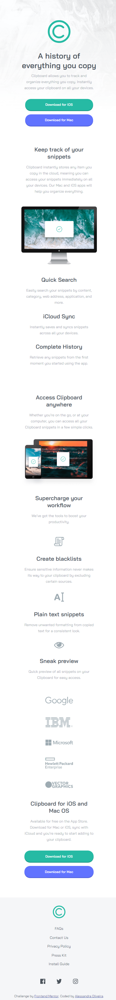

# Frontend Mentor - Clipboard Landing Page Solution

This is a solution to the [Clipboard landing page challenge on Frontend Mentor](https://www.frontendmentor.io/challenges/clipboard-landing-page-5cc9bccd6c4c91111378ecb9).

## Table of contents

- [Overview](#overview)
  - [The challenge](#the-challenge)
  - [Screenshot](#screenshot)
  - [Links](#links)
- [My process](#my-process)
  - [Built with](#built-with)
- [Author](#author)

## Overview

This is my solution to the fylo data storage component challenge on [Frontend Mentor](https://www.frontendmentor.io/home). It was built with HTML and CSS properties.

### The challenge

Users should be able to:

- View the optimal layout for the site depending on their device's screen size
- See hover states for all interactive elements on the page

### Screenshot

This is what my solution looks like on mobile devices and desktop

  

### Links

- Solution URL: [My solution on Frontend Mentor]([https://your-solution-url.com](https://www.frontendmentor.io/solutions/clipboard-landing-page-master-challenge-cCQ1VTZomv))
- Live Site URL: [Live site URL](https://itsale-o.github.io/clipboard-landing-page-master/)

## My process

### Built with

- Semantic HTML5 markup
- CSS custom properties

## Author

- Frontend Mentor - [@itsale-o](https://www.frontendmentor.io/profile/itsale-o)
- LinkedIn - [alessandra-santos-oliveira](https://www.linkedin.com/in/alessandra-santos-oliveira/)
- Twitter - [@itsale_o](https://www.twitter.com/itsale_o)
